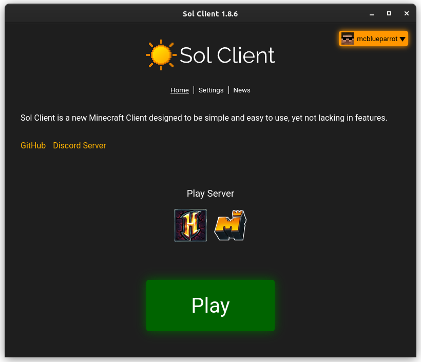
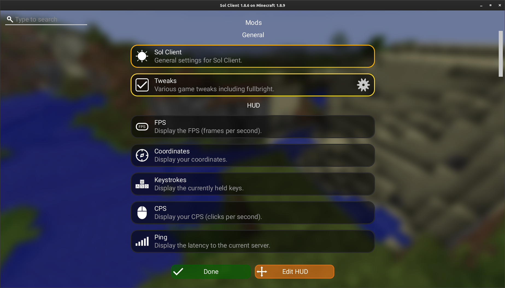

# Sol Client


<a href="https://github.com/Sol-Client/Client/actions/workflows/build.yml"></a>&nbsp;
&nbsp;
&nbsp;
<a href="https://discord.gg/TSAkhgXNbK"></a>&nbsp;
&nbsp;
&nbsp;

Simple and easy-to-use Minecraft client for 1.8.9 (and in future™, newer versions - the [multiversion branch](https://github.com/Sol-Client/Client/tree/dev/multiversion) is being worked on).

[Website & Download](https://sol-client.github.io)&nbsp;&nbsp;
[Discord Server](https://discord.gg/TSAkhgXNbK)

# Screenshots

## Launcher


## Mods


## Pojav
People have already been talking about this client working on Pojav, but it's not quite ready.
However, it does mostly work so you can download a preview from [here](https://github.com/Sol-Client/Installer/releases).

## Licence
This project uses [GNU General Public License v3.0](LICENSE), a copyleft license. This may need to be changed in the future due to it technically conflicting with Minecraft.

While not stated in the licence, I would appreciate forks having a different name, logo, and design. It's fine for feature branches and custom builds though. I'd just rather all of these things changed, not one of them.

Some parts of the code use other licences (such as code "borrowed" from other projects). If this is the case, it will be noted in a comment or another licence file in the same directory.

Note that this project is not entirely open-source due to its closed-source dependencies. There are some open-source reimplementations of Minecraft but are likely to cause bans due to their inaccuracy.

I would also appreciate it if people didn't sell this client.

## Why?
There are many Minecraft clients, but a surprising number of them are closed-source and focus heavily on paid cosmetics. This client is free and open-source, allowing people to view the code and propose changes through GitHub pull requests.

Many other projects lack important features, such as ReplayMod. While this client is still missing some features, it includes the most important ones. There are mod loaders like Fabric, Quilt, and Forge, which are very good, but they lack the same level of integration.

## Features

Here are the main features currently available in the stable version:

- A clean HUD inspired by Lunar.
- Replay Mod. You will need to install FFmpeg yourself. This is completely unaffiliated with the original mod by Johni and CrushedPixel. If you encounter any issues, try reproducing them on the official Forge version, and if it happens there, report it on the [ReplayMod GitHub repository](https://github.com/ReplayMod/ReplayMod). If it only happens on our version, report it here.
- Freelook (automatically disabled on Hypixel), press "V" to activate.
- Toggle sprint.
- Smooth zoom.
- Motion blur (if that's your thing).
- 1.7 animations.
- Item physics.
- Hypixel Additions.
- OptiFine, downloaded automatically from the official site (open an issue if this is a problem).
- Crosshair mod, allowing you to customize your crosshair while fitting with the vanilla style.
- Quick Play Mod. Allows you to quickly join games at the press of a button (by default, "M"). The key opens a menu where you can search for games, navigating through them using the arrow keys. If you type nothing, you can see recent games and a categorized list of all games.
- Customizable launcher servers - automatically detected from the game, with no pinned servers.
- Better item tooltips - show item damage and more.
- Symbol picker (happy, sad, and the extremely important snowman).
- Chat channel display and switcher (you can still use the command).
- Pop-up events (pop-up friend requests, etc.).
- Customizable font and color scheme.
- Option to turn off the inventory logo.
- Speedometer.
- Chunk animator (not sure if many people use this one).
- Bedwars timers.
- Resource pack folders.

Click [this fancy blue text](https://github.com/Sol-Client/Client/projects/1) to see planned features.

If you want to suggest a feature, you can [create a new issue](https://github.com/Sol-Client/Client/issues/new) or [ask on Discord](https://discord.gg/TSAkhgXNbK).

If there are any issues with us using your code, please open an issue.

## Safety
The code for this client is available, so if you have sufficient knowledge, you can check for yourself for any nasty stuff.

This client has been tested by multiple people on Hypixel. On most popular servers, disallowed mods are disabled. There are unknown servers, but just disable the correct mods and you should be fine. All mods are designed (and intend) not to change the behavior of the player.

## Credits
[TheKodeToad](https://github.com/TheKodeToad) ([Discord User](https://discord.com/users/706152404072267788)): Maintainer and developer of the client.

[i9Dolphin](https://github.com/i9Dolphin): Helped create Discord, choose this name (and changed his own one many times) and tested the client.

[sp614x](https://github.com/sp614x): Creator of OptiFine mod.

[Sk1er LLC](https://github.com/Sk1erLLC): Mod inspiration.

[Hyperium](https://github.com/HyperiumClient/Hyperium): Some rendering and launching code. Hopefully will be removed in the future.

[Eric Golde](https://www.youtube.com/c/egold555): A cool dude who inspired me to make my first Minecraft client with MCP. This client is not based on their tutorials though (a lot of people would be quite glad of that).

[tr7zw](https://github.com/tr7zw/EntityCulling): Original EntityCulling mod, a modified version of which is used in this client. May need to be removed for licence change reasons.

[OrangeMarshall](https://namemc.com/profile/OrangeMarshall.1): Original 1.7 Animations mod.

[Johni0702](https://github.com/Johni0702) and [CrushedPixel](https://github.com/CrushedPixel): Replay Mod. Again, a modified version is used for this client.

[robere2](https://github.com/robere2): QuickPlay Mod servers. The mod itself is a different creature. Sorry for not providing you with analytics.

[lumien231](https://github.com/lumien231): Chunk Animator. The version in the client was based on the original Forge mod.

## IDE
### IntelliJ IDEA

1. Close your current project ("File" > "Close Project").
2. Press "Open".
3. Select the "game" directory inside the repository folder.


### Eclipse
1. Right-click in "Package Explorer" and select "Import Project".
2. Select "Gradle" > "Existing Gradle Project".
3. Select the "game" directory inside the repository folder.
4. Press "Finish".

## Build Instructions

Want to contribute? Or are you just trying to re-enable freelook (please don't do this)? Want to port this to your toaster's operating system, or run it on Windows 98?

### Launcher

Make sure you have the latest Node.JS and NPM. You also need to build the game according to the instructions [below](#game).

Setup:
```sh
npm i
```

Start Launcher:
```sh
npm run start
```

Build Installer:
```sh
npm run make
```
The installer will be in a directory named "out".

### Game

Make sure to build it with Java 8 and not any newer versions.

Move into folder:
```sh
cd game
```

Setup:
```sh
./gradlew setupDecompWorkspace
```

Build JAR:
```sh
./gradlew build
```
You will find the result in build/libs/game.jar.

